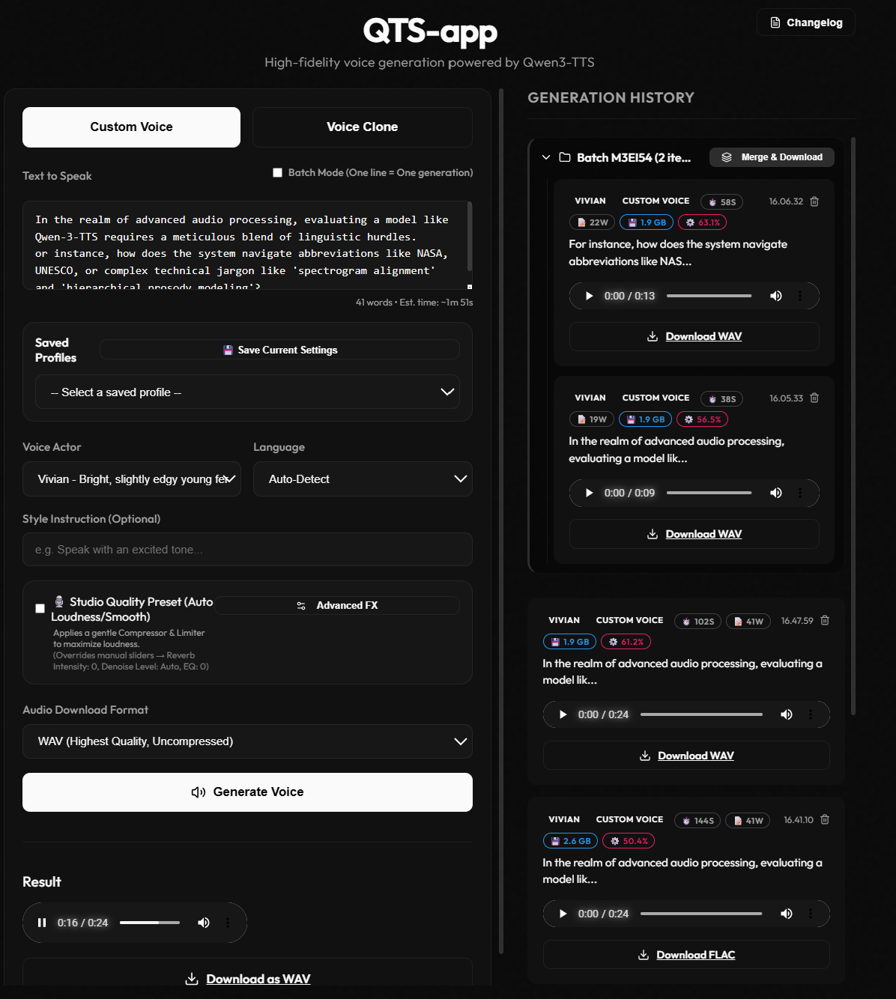

# QTS-app: High-Fidelity Voice Generation



QTS-app is an advanced, lightweight Text-to-Speech (TTS) dashboard powered by Qwen3-TTS. It features an incredibly sleek **Obsidian & Silk** UI, zero-shot voice cloning capabilities, and is uniquely heavily optimized to run locally entirely on CPU hardware with tight RAM constraints.

## Features
- **Custom Voices**: Utilize high-fidelity predefined characters (Vivian, Serena, Uncle Fu, etc.) directly in your browser.
- **Instant Voice Cloning**: Clone any voice from a 3-10 second audio sample instantly. Uses an "Instant Clone" x-vector mode that bypasses the need for transcriptions entirely.
- **Auto-Transcription**: When a reference transcript is required, the app automatically transcribes your uploaded reference audio using a fast, local Whisper-tiny model.
- **Personal Voice Library**: Permanently save your customized or cloned voice configurations for immediate future use.
- **Audio Streaming (TTFB)**: Utilizes Server-Sent Events (SSE) to stream audio chunks straight to your browser as soon as the first sentence completes generating.
- **Intelligent Text Chunking**: Uses Natural Language Toolkit (`nltk`) to intelligently split infinitely long scripts into sentence-sized chunks to prevent RAM bloat.
- **Background Batch Queue**: Send multiple scripts to a background task queue while you continue working, grouping the final outputs cleanly into collapsible folders.
- **Studio Audio FX**: An integrated audio mastering chain (Compressor, Limiter, Reverb, EQ, Denoise) to give AI voices a professional, podcast-ready polish.
- **Real-Time Telemetry**: Keep an eye on your actual hardware limits with live UI badges displaying real-time RAM and peak CPU usage.
- **"Obsidian & Silk" UX**: A premium, minimalist interface built with React/Vite. Snappy spring-physics animations, extreme CPU-efficient styling (no heavy glassmorphism), and a rich deep-dark aesthetic.

## Architecture & Hardware Optimization
- **Decoupled Stack**: FastAPI Python backend + React/Vite frontend.
- **Hardware Profile**: Optimized specifically for ultra-low spec, CPU-only local execution. The app was built and tested specifically on:
  - **Processor**: 11th Gen Intel(R) Core(TM) i5-11300H @ 3.10GHz
  - **Memory**: 8.00 GB RAM (7.70 GB usable)
  - **Graphics**: Intel(R) Iris(R) Xe Graphics (128 MB VRAM)
  - **System**: 64-bit Windows OS
- **Model Efficiency**: 
  - CUDA/Flash Attention is explicitly disabled (running entirely on the Intel CPU). 
  - Utilizes the `0.6B` parameter models natively running in `float32` precision to maximize raw inference speed.
  - Implements a toggleable "Low RAM Mode" (`INT8` PyTorch Dynamic Quantization) for aggressive memory compression when necessary.
  - Prevents severe OS lockups by bypassing Hugging Face `accelerate` during initialization, streaming weights directly to RAM.

## Installation

### 1. Backend (Python/FastAPI)
Navigate to the `backend` directory and install the requirements:
```bash
cd backend
python -m venv venv
source venv/bin/activate  # On Windows: venv\Scripts\activate
pip install -r requirements.txt
```
Run the FastAPI server:
```bash
uvicorn main:app --reload --port 8000
```
*Note: The first time you run this, it will download the Qwen3-TTS-0.6B weights (approx 1.5GB) to your HuggingFace cache.*

### 2. Frontend (React/Vite)
Open a new terminal, navigate to the `frontend` directory:
```bash
cd frontend
npm install
```
Start the development server:
```bash
npm run dev
```
Navigate to `http://localhost:5173` to access the QTS-app dashboard!

## Contributing
Please see `changelog.json` and `documents/devlog.txt` for the semantic versioning schema and recent architectural decisions.

## License
This project is licensed under the **Apache 2.0 License**. See the `LICENSE` file for more details. Because it involves complex AI models and potential intellectual property considerations, this license includes explicit grants of patent rights to protect developers and users alike.
